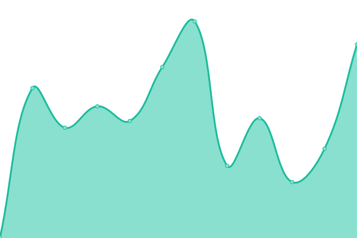
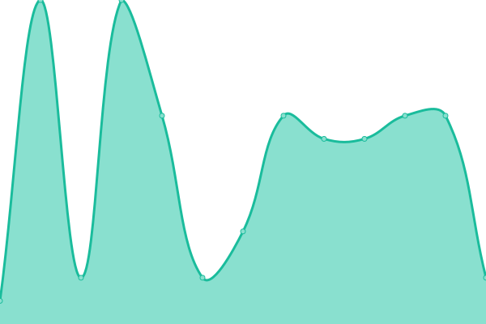
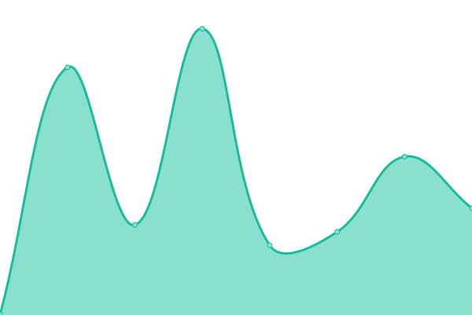
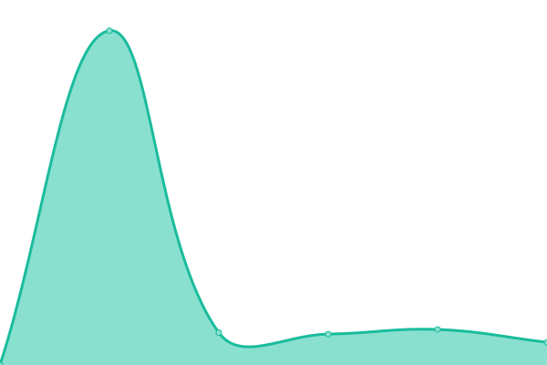

# [📈 Live Status](https://status.infoblock.gq): <!--live status--> **🟩 All systems operational**

<!--start: status pages-->
<!-- This summary is generated by Upptime (https://github.com/upptime/upptime) -->
<!-- Do not edit this manually, your changes will be overwritten -->
<!-- prettier-ignore -->
| URL | Status | History | Response Time | Uptime |
| --- | ------ | ------- | ------------- | ------ |
|  [Website (Github Domain)](https://infoblock.github.io/Website/) | 🟩 Up | [website-github-domain.yml](https://github.com/InfoBlock/Status-Page/commits/HEAD/history/website-github-domain.yml) | 

 292ms
     
 | 

<a href="https://status.infoblock.gq/history/website-github-domain">100.00%</a>
    

|  [Website (Custom Domain)](https://infoblock.thedev.id) | 🟩 Up | [website-custom-domain.yml](https://github.com/InfoBlock/Status-Page/commits/HEAD/history/website-custom-domain.yml) | 

 8ms
     
 | 

<a href="https://status.infoblock.gq/history/website-custom-domain">100.00%</a>
    

|  [Block A.I Website (Github Domain)](https://block-a-i.github.io/BlockWeb/) | 🟩 Up | [block-a-i-website-github-domain.yml](https://github.com/InfoBlock/Status-Page/commits/HEAD/history/block-a-i-website-github-domain.yml) | 

 348ms
     
 | 

<a href="https://status.infoblock.gq/history/block-a-i-website-github-domain">68.90%</a>
    

|  [Block A.I Website (Custom Domain)](https://blockai.infoblock.gq) | 🟩 Up | [block-a-i-website-custom-domain.yml](https://github.com/InfoBlock/Status-Page/commits/HEAD/history/block-a-i-website-custom-domain.yml) | 

 7ms
     
 | 

<a href="https://status.infoblock.gq/history/block-a-i-website-custom-domain">100.00%</a>
    

|  [Preview Website (Github Domain)](https://infoblock.github.io/Preview/) | 🟩 Up | [preview-website-github-domain.yml](https://github.com/InfoBlock/Status-Page/commits/HEAD/history/preview-website-github-domain.yml) | 

 359ms
     
 | 

<a href="https://status.infoblock.gq/history/preview-website-github-domain">68.90%</a>
    

|  [Preview Website (Custom Domain)](https://preview.infoblock.gq) | 🟩 Up | [preview-website-custom-domain.yml](https://github.com/InfoBlock/Status-Page/commits/HEAD/history/preview-website-custom-domain.yml) | 

 10ms
     
 | 

<a href="https://status.infoblock.gq/history/preview-website-custom-domain">68.90%</a>
    

<!--end: status pages-->

[**Visit our status website →**](https://status.infoblock.gq)

## 📄 License

- Code: [MIT](./LICENSE) © [InfoBlock](https://infoblock.github.io/Website/)
- Data in the `./history` directory: [Open Database License](https://opendatacommons.org/licenses/odbl/1-0/)
